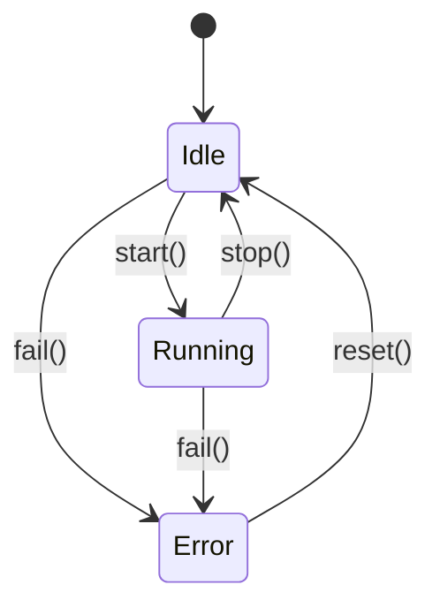

# Fluxo Type-State: Detailed Planning Document

## Project Overview

**Crate Name:** `fluxo-typestate`

**Repository:** `https://github.com/fluxo-labs/fluxo-typestate`

**Purpose:** A procedural macro crate that automatically generates type-state pattern implementations from enum definitions, providing zero-cost abstraction, compile-time state transition validation, optional logging, and Mermaid diagram visualization.

---

## 1. Vision & Mission

### 1.1 Problem Statement
The Type-State Pattern in Rust is powerful but verbose. Developers must manually create separate structs for each state, implement transition methods, and ensure compile-time safety. This leads to boilerplate code that's error-prone and hard to maintain.

### 1.2 Solution
Fluxo Typestate automates this process by:
- Parsing an enum definition as the state machine specification
- Generating dedicated structs with state-specific data
- Creating safe transition methods that consume the old state
- Validating transitions at compile-time
- Providing optional debugging via tracing and visualization

### 1.3 Alignment with Fluxo Labs Mission
> *"Fluxo Labs is an open-source collective dedicated to crafting high-performance, zero-cost architectural primitives for the Rust ecosystem. We believe that complex design patterns shouldn't be a burden, but a compile-time guarantee."*

Fluxo Typestate embodies this mission by making the type-state pattern a compile-time guarantee, eliminating runtime overhead.

---

## 2. Crate Architecture

### 2.1 Workspace Structure

```
fluxo-typestate/
├── Cargo.toml              # Workspace manifest
├── LICENSE                 # MIT License
├── README.md               # Quick start guide
├── CONTRIBUTING.md         # Contribution guidelines
├── CHANGELOG.md            # Version history
├── .github/
│   └── workflows/
│       ├── ci.yml          # CI pipeline
│       └── release.yml     # Release/publish pipeline
├── fluxo-typestate/        # Main library crate
│   ├── Cargo.toml
│   ├── src/
│   │   ├── lib.rs          # Main entry point
│   │   ├── state.rs        # State trait and types
│   │   ├── transition.rs   # Transition logic
│   │   └── error.rs        # Error types
│   └── docs/
│       ├── index.md        # Documentation index
│       ├── manual.md       # Comprehensive manual
│       ├── guide.md        # User guide
│       ├── api/            # API reference docs
│       │   ├── state_machine.md
│       │   ├── transitions.md
│       │   └── examples.md
│       └── tutorials/
│           ├── getting_started.md
│           ├── advanced_usage.md
│           └── migration_guide.md
├── fluxo-typestate-macros/ # Procedural macro crate
│   ├── Cargo.toml
│   ├── src/
│   │   ├── lib.rs          # Macro entry point
│   │   ├── derive/
│   │   │   ├── mod.rs       # Module exports
│   │   │   ├── state.rs     # State derive
│   │   │   └── transition.rs # Transition derive
│   │   ├── parse/
│   │   │   ├── mod.rs       # Parsing utilities
│   │   │   └── enum.rs      # Enum parsing
│   │   └── generate/
│   │       ├── mod.rs        # Code generation
│   │       ├── struct.rs     # Struct generation
│   │       ├── impl.rs       # Impl generation
│   │       └── mermaid.rs    # Mermaid diagram generation
│   └── tests/
│       └── test_all.rs     # Comprehensive tests
└── examples/
    ├── basic/              # Basic usage examples
    │   └── computer.rs
    ├── advanced/           # Advanced examples
    │   └── order_processing.rs
    └── real_world/         # Real-world scenarios
        └── http_connection.rs
```

### 2.2 Dependencies

#### fluxo-typestate (Main Crate)
```toml
[package]
name = "fluxo-typestate"
version = "0.1.0"
edition = "2024"
license = "MIT"
description = "Zero-cost type-state pattern via procedural macros"
authors = ["Fluxo Labs <hello@fluxolabs.dev>", "Alisio85"]
repository = "https://github.com/fluxo-labs/fluxo-typestate"

[dependencies]
fluxo-typestate-macros = { version = "0.1.0", path = "../fluxo-typestate-macros" }
tracing = { version = "0.1", optional = true }
serde = { version = "1.0", features = ["derive"], optional = true }

[dev-dependencies]
trybuild = "1.0"
static_assertions = "1.1"
```

#### fluxo-typestate-macros (Macro Crate)
```toml
[package]
name = "fluxo-typestate-macros"
version = "0.1.0"
edition = "2024"
license = "MIT"
description = "Procedural macros for fluxo-typestate"
authors = ["Fluxo Labs <hello@fluxolabs.dev>", "Alisio85"]

[dependencies]
proc-macro2 = "1.0"
quote = "1.0"
syn = { version = "2.0", features = ["full", "parsing"] }
heck = "0.4"
```

---

## 3. Core Concepts

### 3.1 The Type-State Pattern

The type-state pattern uses Rust's type system to encode state information, making invalid state transitions compile-time errors.

**Without Fluxo (Manual):**
```rust
struct ComputerIdle;
struct ComputerRunning { cpu_load: f32 }
struct ComputerSleeping;

trait State {}
impl State for ComputerIdle {}
impl State for ComputerRunning {}
impl State for ComputerSleeping {}

enum ComputerState {
    Idle(ComputerIdle),
    Running(ComputerRunning),
    Sleeping(ComputerSleeping),
}

impl ComputerState {
    fn new() -> Self { ComputerState::Idle(ComputerIdle) }
    
    fn start(self) -> ComputerState {
        match self {
            ComputerState::Idle(_) => ComputerState::Running(ComputerRunning { cpu_load: 0.0 }),
            _ => panic!("Cannot start from {}", /* state name */),
        }
    }
}
```

**With Fluxo:**
```rust
use fluxo_typestate::{state_machine, State};

#[state_machine]
enum Computer {
    Idle,
    Running { cpu_load: f32 },
    Sleeping,
}

impl Computer {
    fn new() -> Computer<Idle> { Computer::new() }
    
    fn start(self) -> Computer<Running> { /* auto-generated */ }
    
    fn sleep(self) -> Computer<Sleeping> { /* auto-generated */ }
}
```

### 3.2 What Fluxo Generates

For each enum variant, Fluxo generates:

1. **State Structs:**
   ```rust
   pub struct Idle;
   pub struct Running {
       pub cpu_load: f32,
   }
   pub struct Sleeping;
   ```

2. **State Trait:**
   ```rust
   pub trait State: Sealed {}
   ```

3. **Main State Wrapper:**
   ```rust
   pub struct Computer<S: State> {
       _state: PhantomData<S>,
       /* fields from enum variants */
   }
   ```

4. **Transition Methods:**
   ```rust
   impl Computer<Idle> {
       pub fn start(self) -> Computer<Running> { /* ... */ }
       pub fn sleep(self) -> Computer<Sleeping> { /* ... */ }
   }
   
   impl Computer<Running> {
       pub fn stop(self) -> Computer<Idle> { /* ... */ }
       pub fn suspend(self) -> Computer<Sleeping> { /* ... */ }
   }
   ```

5. **Mermaid Diagram (via attribute):**
   ```mermaid
   stateDiagram-v2
       [*] --> Idle
       Idle --> Running: start()
       Running --> Idle: stop()
       Running --> Sleeping: suspend()
       Sleeping --> Idle: wake()
   ```

---

## 4. User-Facing API

### 4.1 Main Attributes

#### `#[state_machine]`
The primary attribute that generates the type-state implementation.

```rust
use fluxo_typestate::state_machine;

#[state_machine]
enum MyState {
    #[transition(Idle -> Running: start)]
    #[transition(Idle -> Error: fail)]
    Idle,
    Running { data: i32 },
    Error { message: String },
}
```

#### `#[trace]`
Enables automatic event logging via `tracing`.

```rust
#[state_machine]
#[trace]
enum TracedComputer {
    Idle,
    Running { cpu_load: f32 },
    Sleeping,
}
```

#### `#[visualize]`
Generates Mermaid diagram (enabled by default, can be disabled).

```rust
#[state_machine]
#[visualize(file = "docs/state_machine.mermaid")]
enum NetworkConnection {
    Disconnected,
    Connecting,
    Connected { latency: u32 },
    Reconnecting,
}
```

### 4.2 Traits

#### `State` Trait
```rust
pub trait State: Sealed + 'static {
    fn name(&self) -> &'static str;
}
```

#### `StateMachine` Trait
```rust
pub trait StateMachine {
    type InitialState: State;
    
    fn current_state(&self) -> &'static str;
    
    fn can_transition_to<T: State>(&self) -> bool;
}
```

### 4.3 Helper Types

```rust
// Marker type for states
pub struct StateMarker<S>(PhantomData<S>);

// Sealed trait to prevent external implementations
pub trait Sealed {}
```

---

## 5. Macro Implementation Details

### 5.1 Parsing Phase

1. **Input:** Enum definition with attributes
2. **Process:**
   - Parse enum variants (unit, tuple, struct)
   - Extract transition attributes
   - Build state graph (AST)
3. **Output:** Intermediate representation (IR)

### 5.2 Generation Phase

1. **Struct Generation:**
   - Generate unit structs for unit variants
   - Generate tuple/struct variants as-is
   - Add `Sealed` trait implementation

2. **State Wrapper Generation:**
   - Create generic struct `Name<S>`
   - Add fields from all variants
   - Add `PhantomData<S>`

3. **Transition Generation:**
   - For each allowed transition, generate a method that:
     - Consumes `self` (Move semantics)
     - Validates at compile-time
     - Returns new state with data

4. **Mermaid Generation:**
   - Build state diagram from transitions
   - Output to specified file or `fluxo_map.mermaid`

### 5.3 Compile-Time Validation

The macro ensures:
- No invalid state transitions are possible
- State data is only accessible in correct states
- All transitions consume the old state (immutable)

---

## 6. Killer Features Implementation

### 6.1 Zero-Cost Abstractions

**Implementation:**
- All state checking happens at compile-time
- No runtime type checking or enum matching
- `PhantomData` provides zero-size markers
- Generated code is equivalent to hand-written type-state

**Verification:**
```rust
// This compiles to essentially:
struct Computer<S> {
    _state: PhantomData<S>,
    cpu_load: f32, // Only exists in Running, but no runtime cost
}
```

### 6.2 Compile-Time Graph Validation

**Implementation:**
- Macro parses all transitions
- Generates compile error if transition references non-existent state
- Error message includes valid transitions

**Error Example:**
```rust
error: Invalid transition: `Idle -> NonExistent`
   --> src/main.rs:10:5
    |
10  |     Idle -> NonExistent: invalid_transition
    |     ^^^^^^^^^^^^^^^^^^^^
note: Valid transitions from `Idle` are: `start() -> Running`, `fail() -> Error`
```

### 6.3 Automatic Event Logging

**Implementation:**
- Optional `#[trace]` attribute
- Generates `tracing::info!` calls on each transition
- Logs: source state, target state, timestamp, transition method

**Generated Code:**
```rust
impl Computer<Idle> {
    pub fn start(self) -> Computer<Running> {
        tracing::info!(from = "Idle", to = "Running", "Transitioning via start()");
        Computer::<Running> { cpu_load: 0.0 }
    }
}
```

### 6.4 Visualizer

**Implementation:**
- Generates Mermaid state diagram
- Outputs to `fluxo_map.mermaid` by default
- Customizable output path via attribute

**Output:**


---

## 7. GitHub Actions Workflows

### 7.1 CI Pipeline (ci.yml)

**Triggers:**
- Push to `main` and `develop` branches
- Pull requests to any branch

**Jobs:**

1. **Formatting & Linting:**
   ```yaml
   - run: cargo fmt --check
   - run: cargo clippy --all-targets -- -D warnings
   - run: cargo miri test
   ```

2. **Testing:**
   ```yaml
   - run: cargo test --all
   - run: cargo test --doc
   ```

3. **MSRV (Minimum Supported Rust Version):**
   ```yaml
   - toolchain: 1.75.0
   - run: cargo check
   ```

4. **Documentation:**
   ```yaml
   - run: cargo doc --no-deps
   - run: cargo doc --no-deps --document-private-items
   ```

### 7.2 Release Pipeline (release.yml)

**Triggers:**
- Git tag push (`v*`)

**Jobs:**

1. **Test on Multiple Platforms:**
   - Linux (x86_64, ARM64)
   - macOS (x86_64, ARM64)
   - Windows (x86_64)

2. **Security Audit:**
   ```yaml
   - run: cargo audit
   ```

3. **Publish to crates.io:**
   ```yaml
   - run: cargo publish --token ${{ secrets.CRATES_IO_TOKEN }}
   ```

4. **Create GitHub Release:**
   - Generate changelog
   - Upload artifacts

---

## 8. Documentation Structure

### 8.1 Documentation Index (docs/index.md)

```
# Fluxo Typestate Documentation

## Getting Started
- [Quick Start](tutorials/getting_started.md)
- [Installation](manual.md#installation)

## Guides
- [Basic Usage](guide.md)
- [Advanced Usage](tutorials/advanced_usage.md)
- [Migration Guide](tutorials/migration_guide.md)

## API Reference
- [State Machine](api/state_machine.md)
- [Transitions](api/transitions.md)
- [Examples](api/examples.md)
```

### 8.2 Manual (docs/manual.md)

Comprehensive manual covering:
- Philosophy and design principles
- Installation and setup
- Core concepts
- All attributes and their options
- Performance characteristics
- Comparison with alternatives
- Best practices
- Troubleshooting

### 8.3 Tutorials

#### Getting Started (docs/tutorials/getting_started.md)
1. Add dependency
2. Write first state machine
3. Understand generated code
4. Run first transitions

#### Advanced Usage (docs/tutorials/advanced_usage.md)
1. State-specific data
2. Multiple transitions
3. Conditional transitions
4. Event logging
5. Visualization

#### Migration Guide (docs/tutorials/migration_guide.md)
1. From manual type-state
2. From state machines crates
3. Common patterns

---

## 9. Licensing

### 9.1 MIT License

```
MIT License

Copyright (c) 2024 Fluxo Labs
Copyright (c) 2024 AI-generated code based on idea by alisio85

Permission is hereby granted, free of charge, to any person obtaining a copy
of this software and associated documentation files (the "Software"), to deal
in the Software without restriction, including without limitation the rights
to use, copy, modify, merge, publish, distribute, sublicense, and/or sell
copies of the Software, and to permit persons to whom the Software is
furnished to do so, subject to the following conditions:

The above copyright notice and this permission notice shall be included in all
copies or substantial portions of the Software.

THE SOFTWARE IS PROVIDED "AS IS", WITHOUT WARRANTY OF ANY KIND, EXPRESS OR
IMPLIED, INCLUDING BUT NOT LIMITED TO THE WARRANTIES OF MERCHANTABILITY,
FITNESS FOR A PARTICULAR PURPOSE AND NONINFRINGEMENT. IN NO EVENT SHALL THE
AUTHORS OR COPYRIGHT HOLDERS BE LIABLE FOR ANY CLAIM, DAMAGES OR OTHER
LIABILITY, WHETHER IN AN ACTION OF CONTRACT, TORT OR OTHERWISE, ARISING FROM,
OUT OF OR IN CONNECTION WITH THE SOFTWARE OR THE USE OR OTHER DEALINGS IN THE
SOFTWARE.
```

### 9.2 Credits

All files will include:
```rust
// Copyright (c) 2024 Fluxo Labs
// AI-generated code based on idea by alisio85
// SPDX-License-Identifier: MIT
```

---

## 10. Development Phases

### Phase 1: Foundation (Week 1)
- [ ] Set up workspace structure
- [ ] Implement basic macro parsing
- [ ] Generate simple state structs
- [ ] Basic tests

### Phase 2: Core Features (Week 2)
- [ ] Implement transitions
- [ ] Add State trait
- [ ] Implement compile-time validation
- [ ] Basic documentation

### Phase 3: Advanced Features (Week 3)
- [ ] Implement `#[trace]` attribute
- [ ] Implement Mermaid visualization
- [ ] Add examples
- [ ] Comprehensive testing

### Phase 4: Polish (Week 4)
- [ ] Full documentation
- [ ] CI/CD setup
- [ ] Security audit
- [ ] MSRV testing
- [ ] Publish to crates.io

---

## 11. Success Metrics

1. **Zero Runtime Overhead:** Benchmarks show no difference vs hand-written type-state
2. **Compile-Time Safety:** All invalid transitions caught at compile-time
3. **Documentation Quality:** docs.rs renders perfectly
4. **CI Pass Rate:** 100% green on all platforms
5. **No Warnings:** `cargo clippy` passes with zero warnings
6. **No Errors:** `cargo test` passes with zero errors

---

## 12. Alternative Names Considered

| Name | Pros | Cons |
|------|------|------|
| `fluxo-typestate` (chosen) | Clear purpose, matches org | Longer |
| `fluxo-state` | Shorter | Less specific |
| `fluxo-fsm` | Familiar acronym | Not just FSM |
| `fluxo-automaton` | Mathematical | Too academic |

---

## 13. References

- [Type-State Pattern in Rust](https://cliffle.com/blog/rust-typestate/)
- [Rust RFC: Type-state](https://github.com/rust-lang/rfcs/pull/2306)
- [Proc Macro Workshop](https://github.com/dtolnay/proc-macro-workshop)
- [Mermaid State Diagrams](https://mermaid.js.org/state-diagram.html)

---

*Document Version: 1.0*  
*Created: 2024*  
*Author: AI assistant based on idea by alisio85*  
*License: MIT (Fluxo Labs)*
