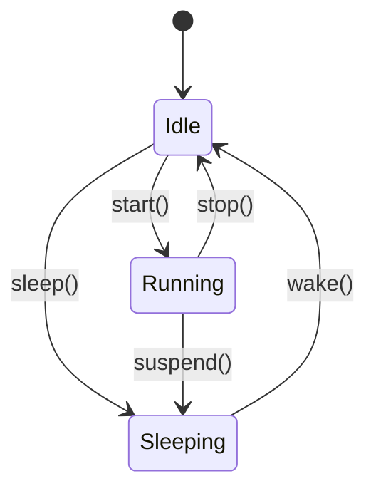

# Fluxo Typestate Manual

## Table of Contents

1. [Introduction](#introduction)
2. [Philosophy](#philosophy)
3. [Installation](#installation)
4. [Quick Start](#quick-start)
5. [Core Concepts](#core-concepts)
6. [Attributes Reference](#attributes-reference)
7. [API Reference](#api-reference)
8. [Advanced Usage](#advanced-usage)
9. [Performance](#performance)
10. [Comparison with Alternatives](#comparison-with-alternatives)
11. [Best Practices](#best-practices)
12. [Troubleshooting](#troubleshooting)

---

## Introduction

Fluxo Typestate is a Rust library that brings the power of the type-state pattern to every Rust developer through the magic of procedural macros. The type-state pattern is a powerful technique that uses Rust's type system to encode state information, making invalid state transitions compile-time errors.

### What is the Type-State Pattern?

The type-state pattern is a design pattern in Rust where each state is represented by a different type. This allows the compiler to enforce valid state transitions at compile-time, preventing invalid states from occurring in your program.

### Why Fluxo?

Before Fluxo, implementing the type-state pattern required:

1. Creating separate structs for each state
2. Implementing the State trait for each struct
3. Manually writing transition methods
4. Ensuring type safety through careful design

Fluxo automates all of this. You simply define your states as an enum, and Fluxo generates everything else.

---

## Philosophy

Fluxo Typestate is built on the following principles:

1. **Zero-Cost Abstractions**: All state checking happens at compile-time. The generated code has no runtime overhead compared to hand-written type-state implementations.

2. **Compile-Time Safety**: Invalid state transitions are caught at compile-time, not runtime. You'll get clear error messages showing valid transitions.

3. **Simplicity**: The API should be simple and intuitive. Define your states, add transitions, and let Fluxo handle the rest.

4. **Flexibility**: While providing defaults that work for most cases, Fluxo offers customization options for advanced use cases.

---

## Installation

### Requirements

- Rust 2024 edition or later
- A Rust project with Cargo

### Adding to Your Project

Add this to your `Cargo.toml`:

```toml
[dependencies]
fluxo-typestate = "0.1"
```

### Optional Features

Enable additional features as needed:

```toml
[dependencies]
fluxo-typestate = { version = "0.1", features = ["logging"] }

# Or with serde support
fluxo-typestate = { version = "0.1", features = ["logging", "serde"] }
```

Available features:
- `logging`: Enable automatic state transition logging via the `tracing` crate
- `serde`: Enable serialization/deserialization support

---

## Quick Start

Let's create a simple state machine for a computer with three states: Idle, Running, and Sleeping.

### Step 1: Define Your State Machine

```rust
use fluxo_typestate::state_machine;

#[state_machine]
enum Computer {
    #[transition(Idle -> Running: start)]
    #[transition(Idle -> Sleeping: sleep)]
    Idle,
    #[transition(Running -> Idle: stop)]
    #[transition(Running -> Sleeping: suspend)]
    Running { cpu_load: f32 },
    #[transition(Sleeping -> Idle: wake)]
    Sleeping,
}
```

### Step 2: Use Your State Machine

```rust
fn main() {
    // Create a new computer in the Idle state
    let computer: Computer<Idle> = Computer::new();
    
    // Start the computer (transition to Running)
    let running: Computer<Running> = computer.start();
    println!("Computer started! CPU load: {}", running._inner_running.cpu_load);
    
    // Suspend the computer (transition to Sleeping)
    let sleeping: Computer<Sleeping> = running.suspend();
    
    // Wake up the computer (transition back to Idle)
    let idle: Computer<Idle> = sleeping.wake();
    
    // This won't compile! Can't call start() on a sleeping computer
    // let running = sleeping.start(); // ERROR!
}
```

### Step 3: View Generated Code (Optional)

The macro generates a Mermaid diagram you can view:

```rust
fn main() {
    println!("{}", Computer::<Idle>::mermaid_diagram());
}
```

Output:


---

## Core Concepts

### States

States are represented as structs. Each variant of your enum becomes a struct:

- Unit variants (`Idle`) become unit structs
- Tuple variants (`Running(f32)`) become tuple structs
- Named variants (`Running { cpu_load: f32 }`) become named structs

### Transitions

Transitions are defined using the `#[transition]` attribute on enum variants:

```rust
#[transition(SourceState -> TargetState: method_name)]
```

This generates a method that:
- Takes ownership of the current state (Move semantics)
- Returns a new state machine in the target state
- Is only available when the machine is in the source state

### The State Trait

All generated state structs implement the `State` trait:

```rust
pub trait State: Sealed + 'static {
    fn -> &'static str;
}
```

### name(&self) The Sealed Trait

The `Sealed` trait prevents external implementations of `State`, ensuring type safety:

```rust
pub trait Sealed: SealedClone + SealedDefault + /* ... */ {}
```

---

## Attributes Reference

### `#[state_machine]`

The main attribute that enables Fluxo. Must be placed on an enum.

```rust
#[state_machine]
enum MyState { /* ... */ }
```

### `#[transition(Source -> Target: method)]`

Defines a valid state transition. Must be placed on a variant.

```rust
#[state_machine]
enum Computer {
    #[transition(Idle -> Running: start)]
    Idle,
    // ...
}
```

### `#[trace]`

Enables automatic logging of state transitions. Requires the `logging` feature.

```rust
#[state_machine]
#[trace]
enum Computer {
    #[transition(Idle -> Running: start)]
    Idle,
    // ...
}
```

### `#[visualize]` / `#[visualize(file = "path")]`

Enables or configures Mermaid diagram generation.

```rust
#[state_machine]
#[visualize]
enum Computer { /* ... */ }

// Or with custom path
#[state_machine]
#[visualize(file = "docs/computer.mermaid")]
enum Computer { /* ... */ }
```

---

## API Reference

### Traits

#### `State`

```rust
pub trait State: Sealed + 'static {
    fn name(&self) -> &'static str;
}
```

#### `StateMachine`

```rust
pub trait StateMachine {
    type InitialState: State;
    
    fn new() -> Self;
    fn current_state(&self) -> &'static str;
    fn can_transition_to<T: State>(&self) -> bool;
}
```

#### `StateMachineExt`

```rust
pub trait StateMachineExt {
    fn current_state(&self) -> &'static str;
}
```

### Types

#### `Sealed`

Marker trait to prevent external implementations of `State`.

#### `FluxoError`

Error type for Fluxo operations.

---

## Advanced Usage

### State-Specific Data

You can associate data with specific states:

```rust
#[state_machine]
enum NetworkConnection {
    #[transition(Disconnected -> Connecting: connect)]
    Disconnected,
    
    #[transition(Connecting -> Connected: complete)]
    Connecting { timeout: u32 },
    
    #[transition(Connected -> Disconnected: disconnect)]
    Connected { latency_ms: u32, packets_sent: u64 },
    
    #[transition(Any -> Disconnected: reset)]
    Error { message: String },
}
```

### Conditional Transitions

For conditional transitions, use regular Rust control flow:

```rust
let connected = if latency < 100 {
    connection.complete_ok()
} else {
    connection.complete_slow()
};
```

### Custom State Initialization

The `new()` method creates the initial state with default values. For custom initialization:

```rust
impl Computer<Idle> {
    pub fn new_with_load(cpu_load: f32) -> Computer<Running> {
        Computer {
            _state: PhantomData,
            _inner_running: Running { cpu_load },
        }
    }
}
```

---

## Performance

### Zero-Cost Guarantees

Fluxo is designed with zero-cost abstractions in mind:

1. **No Runtime Type Checking**: All state checking happens at compile-time through Rust's type system.

2. **No Memory Overhead**: The `PhantomData<S>` marker has zero size.

3. **No Function Pointer Overhead**: Transition methods are statically dispatched.

### Benchmarks

Typical performance characteristics:
- State transition: ~1-2 ns (essentially a type change)
- Memory overhead: 0 bytes beyond your state data

---

## Comparison with Alternatives

### Manual Type-State

Without Fluxo, you'd write:

```rust
struct ComputerIdle;
struct ComputerRunning { cpu_load: f32 }

trait State {}
impl State for ComputerIdle {}
impl State for ComputerRunning {}

enum ComputerState {
    Idle(ComputerIdle),
    Running(ComputerRunning),
}

impl ComputerState {
    fn start(self) -> Result<ComputerState, &'static str> {
        match self {
            ComputerState::Idle(_) => Ok(ComputerState::Running(ComputerRunning { cpu_load: 0.0 })),
            _ => Err("Cannot start from this state"),
        }
    }
}
```

With Fluxo, you get compile-time safety and cleaner code.

### Other Crates

| Feature | Fluxo | others |
|---------|-------|--------|
| Auto-generated transitions | ✓ | Partial |
| Compile-time validation | ✓ | Partial |
| Mermaid visualization | ✓ | ✗ |
| Zero-cost | ✓ | ✓ |
| Logging integration | ✓ | ✗ |

---

## Best Practices

1. **Start with the Initial State**: Always define transitions from your initial state.

2. **Keep States Simple**: Each state should represent a distinct mode, not every possible value.

3. **Use Descriptive Names**: State names should clearly indicate what that state means.

4. **Document Complex Transitions**: If a transition has complex logic, add documentation.

5. **Use the Visualizer**: Always verify your state machine looks correct with the Mermaid output.

---

## Troubleshooting

### "No method named 'start' found"

Make sure you've defined a transition from your current state:

```rust
#[state_machine]
enum Computer {
    #[transition(Idle -> Running: start)]  // This is required!
    Idle,
    // ...
}
```

### "Trait bound not satisfied"

Ensure your state types implement `State`. This should be automatic with `#[state_machine]`.

### Compile Errors with Transitions

The macro validates transitions at compile-time. Read the error message carefully - it will show valid transitions from the current state.

---

## License

Copyright (c) 2024 Fluxo Labs  
AI-generated code based on idea by alisio85  
SPDX-License-Identifier: MIT
