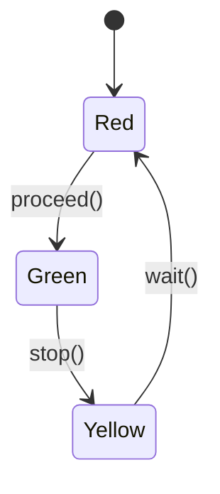

# Getting Started with Fluxo Typestate

This tutorial will guide you through creating your first Fluxo Typestate state machine.

## Prerequisites

- Rust 2024 edition or later
- Basic knowledge of Rust

## Step 1: Create a New Project

```bash
cargo new my_fluxo_app
cd my_fluxo_app
```

## Step 2: Add Fluxo as a Dependency

```bash
cargo add fluxo-typestate
```

Or manually add to `Cargo.toml`:

```toml
[dependencies]
fluxo-typestate = "0.1"
```

## Step 3: Your First State Machine

Let's create a simple traffic light state machine:

```rust
// main.rs
use fluxo_typestate::state_machine;

#[state_machine]
enum TrafficLight {
    #[transition(TrafficLight::Red -> TrafficLight::Green: go)]
    Red,
    #[transition(TrafficLight::Green -> TrafficLight::Yellow: stop)]
    Green,
    #[transition(TrafficLight::Yellow -> TrafficLight::Red: wait)]
    Yellow,
}

fn main() {
    let light: TrafficLight<Red> = TrafficLight::new();
    
    // Go from Red to Green
    let green: TrafficLight<Green> = light.go();
    
    // Stop from Green to Yellow
    let yellow: TrafficLight<Yellow> = green.stop();
    
    // Wait from Yellow back to Red
    let red: TrafficLight<Red> = yellow.wait();
    
    println!("Traffic light cycle complete!");
}
```

## Step 4: Understanding What's Generated

The macro generates:

1. **State structs**: `Red`, `Green`, `Yellow`
2. **Main wrapper**: `TrafficLight<S>`
3. **Transition methods**: `go()`, `stop()`, `wait()`
4. **Constructor**: `new()`

## Step 5: Try Invalid Transitions

Try adding this code - it won't compile!

```rust
fn main() {
    let light: TrafficLight<Red> = TrafficLight::new();
    
    // ERROR: Can't stop from Red - there's no transition from Red to anything but Green
    let stopped = light.stop(); // COMPILE ERROR!
}
```

You'll get a clear error message:
```
error[E0599]: no method named `stop` found for struct `TrafficLight<Red>`
```

## Step 6: Add State Data

Let's enhance our traffic light with timing data:

```rust
use fluxo_typestate::state_machine;

#[state_machine]
enum TrafficLight {
    #[transition(Red -> Green: proceed)]
    Red { timer_secs: u32 },
    #[transition(Green -> Yellow: stop)]
    Green { timer_secs: u32 },
    #[transition(Yellow -> Red: wait)]
    Yellow { timer_secs: u32 },
}

fn main() {
    let red: TrafficLight<Red> = TrafficLight {
        _state: std::marker::PhantomData,
        _inner_red: Red { timer_secs: 60 },
    };
    
    let green: TrafficLight<Green> = red.proceed();
    println!("Green light for {} seconds", green._inner_green.timer_secs);
}
```

## Step 7: Enable Logging (Optional)

To see state transitions in action:

1. Enable the logging feature in `Cargo.toml`:
```toml
[dependencies]
fluxo-typestate = { version = "0.1", features = ["logging"] }
```

2. Add the `#[trace]` attribute:

```rust
#[state_machine]
#[trace]
enum TrafficLight {
    #[transition(Red -> Green: proceed)]
    Red { timer_secs: u32 },
    // ...
}
```

3. Add a tracing subscriber to your `main()`:

```rust
use tracing_subscriber::fmt;

fn main() {
    fmt::init();
    
    let light: TrafficLight<Red> = TrafficLight::new();
    // Now you'll see logs like:
    // INFO  from = "Red", to = "Green", "State transition via proceed()"
}
```

## Step 8: Visualize Your State Machine

Print the Mermaid diagram:

```rust
fn main() {
    println!("{}", TrafficLight::<Red>::mermaid_diagram());
}
```

Output:


## Summary

You've learned how to:

1. Create a basic state machine
2. Define transitions between states
3. Add state-specific data
4. Enable logging for debugging
5. Generate visualization diagrams

Next, check out the [Advanced Usage](advanced_usage.md) tutorial for more complex scenarios.

---

**License**: Copyright (c) 2024 Fluxo Labs  
**Author**: AI-generated code based on idea by alisio85
